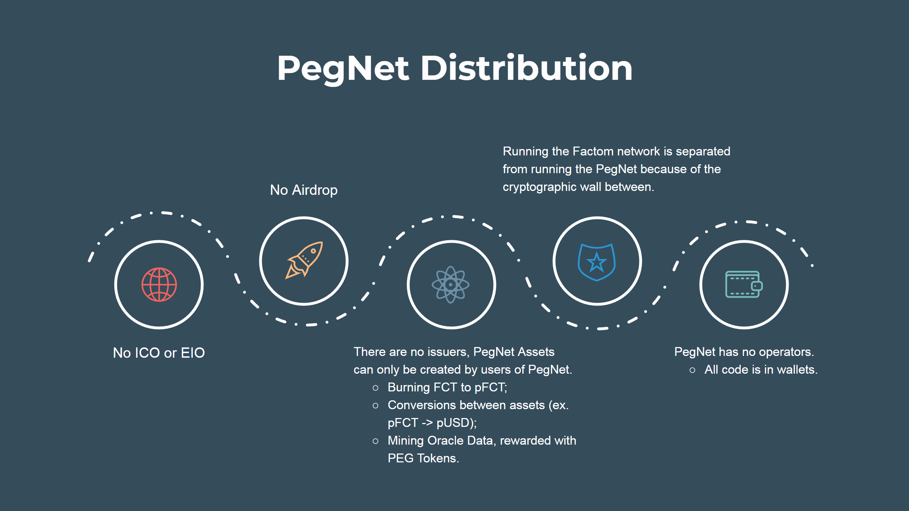
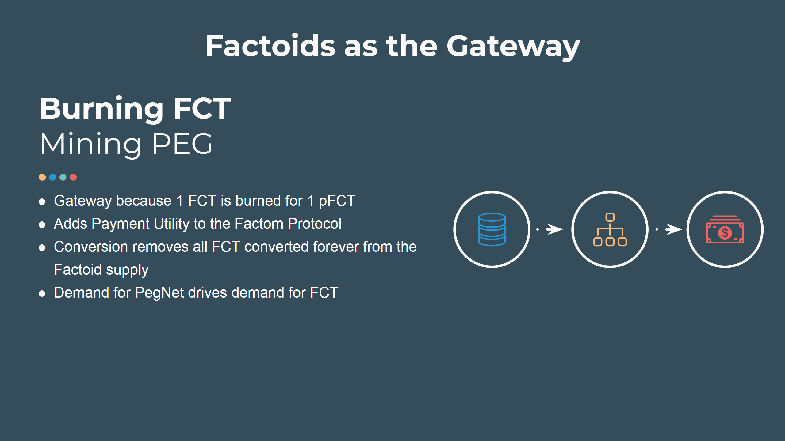
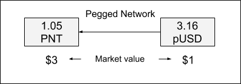
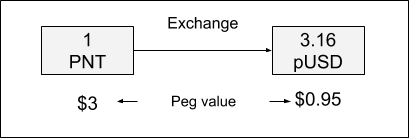
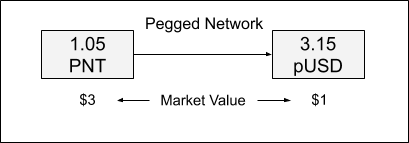
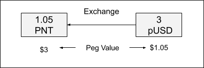
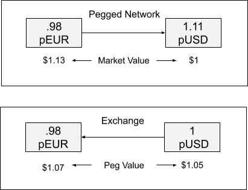
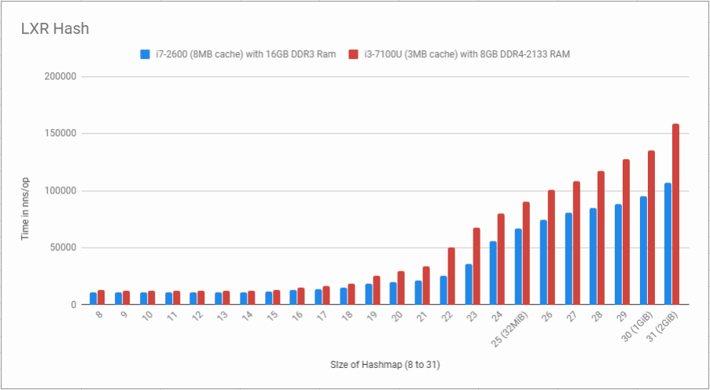
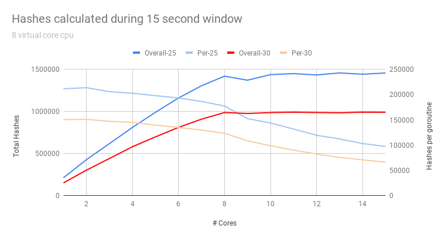

# PegNet:  A Network of Pegged Tokens

## Abstract
Pegged tokens are generally useful for payments, treasury management, exchanges, and wealth preservation.  A Pegged Token network defines a set of pegged tokens, which reflect real market assets such as currencies, precious metals, other cryptocurrency assets, commodities, etc.  For example, a token pegged to USD can be used to make USD purchases, and both the buyer and seller can be assured of the payment with the pegged value will be very close to equal to the dollar equivalent.  For companies holding cryptocurrency assets, the ability to convert parts of those assets into a dollar peg can help to preserve capital when the cryptocurrency market is low.  Exchanges that deal only with cryptocurrencies can use values pegged to real world currencies to create pegs to USD or EUR without having to deal with the traditional banking system to hold those assets.  Tokens pegged to other assets like precious metals allow users to hold Gold or Silver values on a cryptocurrency exchange.  Pegging to cryptocurrencies can facilitate transactions representing Bitcoin or other cryptocurrency values without the transaction limitations that might exist on the those  blockchains.  Pegging values to other commodities or assets are possible, expanding the use cases for a Pegged Token Network.  This paper describes Pegged Token Networks in more detail, and goes into an implementation and design of such a network, based on the Factom Protocol.

## Introduction
A pegged token is often referred to as a stable coin. To date stable coins are single tokens that use a range of mechanisms to maintain their peg to the real world assets they represent. PegNet is a Pegged Token Network, and it leverages simple game theory and a set of pegged tokens that self reinforce each other in holding their mutual pegs.  The network provides a mechanism for managing payments, treasury allocations, risk abatement, arbitrage, and budgets across jurisdictions without requiring expensive and slow processes through external parties such as financial institutions, payment processors, exchanges, etc.  
A possible set of assets that would have corresponding pegged tokens might include:

| Currencies       | Precious Metals | Cryptocurrencies       |
| :--------------- |:--------------- | :--------------------- |
| US Dollar        | Gold            | PEG (The PegNet Token) |
| Euro             | Silver          | Factom                 |
| Japanese Yen     | Platinum        | Bitcoin                |
| British Pound    | Palladium       | Ethereum               |
| Canadian Dollar  |                 | Dash                   |
| Swiss Franc      |                 | Bitcoin Cash           |
| Indian Rupee     |                 | Binance Coin           |
| Singapore Dollar |                 | Stellar                |
| Chinese Yuan     |                 | Cardano                |
| Hong Kong Dollar |                 | Monero                 |
| Taiwanese Dollar |                 | Zcash                  |
| Korean Won       |                 | Decred                 |
| Argentine Peso   |                 | Litecoin               |
| Brazillian Peso  |                 | Ravencoin              |
| Phillipine Peso  |                 |                        |
| Mexican Peso     |                 |                        |

The pegged token for an asset would be designated by adding a ‘p’ to the asset designator.  So the pegged token tracking USD would be pUSD.  Gold would have a pegged token of pGold.  Having a range of pegged tokens would allow the user of PegNet to maintain their holdings in any of the assets supported, and to make transactions in any of the assets supported.
Asset selection should be driven by market value, availability of market data, and value of the use cases for the pegged token.

## Definitions
1. **PegNet** -- A network of tokens pegged to multiple market defined assets and values.
Pegged Tokens -- tokens that are pegged to market values.  These market values can be currencies, precious metals, stocks, stock indexes, etc.  A token can be pegged to any asset that has a market price. One pegged token for USD, (1 pUSD) has a pegged target value of $1 USD.
2. **PegNet Token (PEG)** --  This is the one token in the PegNet that summarizes the value of the set of pegged tokens in the market.  The market value of all the pegged tokens is used to set the PEG value in the PegNet only during the capitalization phase of the protocol.  After PEG is established on exchanges, exchanges will set the value of PEG. 
3. **PegNet Address** -- A cryptographic address understood by the PegNet. Each address potentially holds balances of any of the Pegged Tokens.
4. **Oracle Price** -- Each Pegged Token has a price gathered from the markets, and documented on chain as the Oracle Price in USD for each token.  
5. **Pegged Token Conversion** -- a conversion can be recorded on the PegNet to convert pegged tokens from one pegged token to another, at the oracle price.  A conversion destroys the source token, and creates the destination token, with no change of value other than the fee.  The fee is burned. Also note that no change of control is involved by a pegged token conversion.  This is user initiated, and the conversion changes the balances of the Pegged Tokens tied to the PegNet address.   
6. **PegNet Transaction** -- a transaction moving pegged tokens from one address to another.  

## Implementation
The Pegged Network implementation is very simple.  First of all, the Peg (PEG) is the base token of the PegNet.  To boot strap the network the value of PEG will be pegged to 1 to 1 with the aggregated value of all the assets on the network. After PEG is listed on exchanges the peg will be removed and the PEG price will be allowed to float according to the market price on the exchanges.

A Pegged Network works by allowing users to convert between assets as they wish, according to a set of prices supplied by the Oracles parties that publish price data to the Pegged Network.  See the section on Oracles.  When a Pegged Network launches, there are only PEG tokens created through mining and the burning of the Factom Protocol’s FCT token to pFCT. pFCT can be converted to other assets according to the Oracle prices.  And PEG can be priced by the assets in the PegNet, allowing its conversion into other assets. When the Peg is converted, it is destroyed, and the pegged token is created.  The source of the conversion is the backing for the creation of the destination.

## Arbitrage as a Stability Mechanism
Arbitrage will be the mechanism to maintain the pegged prices on exchanges. Consider the case in the figure below. In this example, pUSD is being priced at .95 cents at an exchange, while PegNet can convert 1 PEG (worth $3 at the exchange)  to 3 pUSD.  

First Image

A savvy trader can now use PEG to buy pUSD at a discount on the exchange, while making the opposite conversion on the Pegged Network:

Second Image

In this example, users are motivated to buy up low priced pUSD on exchanges, since the peg value of pUSD is below the market for USD. Users can both wait for the peg to recover, or go to the Peg Network and maintain their position with a balancing conversion on the Pegged Network.  The gain is a shade over 5 percent, and in the example above the user takes that 5% in PEG.  Of course, they can easily take the 5 percent in USD as well.

The same principle also applies in reverse. In the figure above, the pUSD token is priced higher on an exchange than the value that can be gained from conversion of token through PegNet. Users are then motivated to buy PEG with high priced pUSD on exchanges, since the peg value of pUSD is above the market for USD.
First Image

 Users can simply take their gain on the exchange, or go to the Peg Network and maintain their position with a balancing conversion on the Pegged Network.  The gain is a shade over 5 percent, and in the example above the user takes that 5% in pUSD on the exchange.  Of course, they could keep their gain in PEG too.
Second Image

A network of pegged tokens is more efficient than a simple two token system, such as one with a peg token and a pegged asset. The PegNet increases liquidity and stability of value by aggregating the fractional interests of each reference currency/commodity/token (population of participants) capable of executing an arbitrage.  This is because having more tokens means that the arbitrage has greater leverage when balancing a pegged token that is below its peg with a pegged token that is above its peg. So for example if pUSD is below its peg by 5% and pEUR is above its peg by 5%, you might get the following:

In this example, pEUR is below its peg by 5 percent, and pUSD is above its peg by ~5 percent.  The arbitrage works to bring both the pEUR and the pUSD to their pegged values, and netting the arbitrager 10% gain, which can be held in pEUR or pUSD (choice of the arbitrager).

## Conversions and Transactions
One of the acknowledged issues with cryptocurrency for payments is the currency risk taken by the buying and selling side of a transaction.  Users may feel more comfortable with a particular mix of assets, and wish to frictionlessly leverage those assets in a purchase.  For example, a consumer might hold a volatile asset like Bitcoin and make purchases with that asset from time to time.  In an ideal world, the consumer should be able to convert the Bitcoin to the payment asset requested by a Merchant and make the payment without the friction of going to an exchange.  
Of course, cryptocurrency and commodities like metals generally involve a third party to convert to USD or EUR or any other fiat currency, and that friction is fairly large.  Currencies are more easily converted, but at the cost of currency exchange.  These rates and fees can be quite significant, adding friction to transactions.
The PegNet allows conversion to pegged tokens that track a wide range of currencies, and allow the user to maintain their value in a large set of currencies and assets, and make payments in any of the other pegged currencies and assets without a third party, at a fair market rate, and on demand.  This limits the friction of transactions, and simplifies the payment process on both the buyer and seller side.
Additionally, the on ramp and off ramp into the PegNet is quite flexible.  Any of the Pegged tokens on an exchange can serve as a means of moving value from fiat and crypto currencies into pegged tokens.  When moved from an exchange to a user’s wallet, those tokens can be converted at will to the desired token or currency, or utilized for payments in any pegged token. Likewise, users can move value from pegged tokens into fiat or crypto currencies, via exchanges.

The implementation of the conversion between tokens is pretty simple.  You take a source token and specify a destination token.  The source token and destination token can be the PEG token or any of the pegged tokens like pUSD, pEUR, pGold, pBTC, etc.  The source token is destroyed, and the destination token is created.  The value of each side of the conversion is defined by the oracle, and no additional value is created or destroyed. 
Consider converting 1 token of pBTC to pGold (price in grams).  The Peg Net software computes (from the Oracle Price) the USD value of pBTC and the USD value of pGold.  The pBTC token is destroyed (destroying the USD value of the pBTC), and the pGold tokens created (creating the same USD value of pGold).
Today a FCT address in the Factom Protocol is actually the hash of an RCD (Redeem Condition Data structure).  This hash serves as the public key providing control of any number of the PegNet assets, as well as FCT.  Each user of the PegNet protocol is potentially an issuer of tokens (by either burning FCT to create pFCT as a one way conversion process), mining PEG (by providing oracle data), or converting assets they are holding in the PegNet to other PegNet assets. So an address in the PegNet can be used to make conversions between any of the tokens in the PegNet, and to create transactions that send PegNet tokens to other PegNet addresses.
Conversions between tokens have the following fields:
* Source Token type: Amount of Source Tokens: Destination Token type: 
* PegNet Address: Signature:

A single address can carry balances for all of the tokens in the PegNet.  So a user can send and receive pUSD from the same address as they can send and receive PEG.  From a user experience perspective, the wallet generates particular typed address representations for a particular token in the PegNet.  This prevents someone from accidentally sending PEG to a pUSD address.

## Oracle
The PegNet uses a Proof of Work system to collect pricing data from the market.  Miners are required to invest resources in providing the real time market data to PegNet. As part of the Proof of Work, bad market data is filtered out. Where the investment for submitting data is significant, submitting bad data is not worthwhile because it  is ignored, and submitting good data is rewarded.  
As long as most miners submit good data, the pricing data from the Oracle can be trusted. This means that the network is able to access real world market data. Once collected, the Oracle data is published to the Factom blockchain. The PegNet Oracle algorithm leverages the rotocol’s 10 minute blocks, and has a flexible difficulty mechanism to fit within the Factom block structure.  
Factom blocks are ten minutes long, and are divided into 1 minute sections.  Data can be viewed as having been recorded in each one minute section of a block as the protocol records the data. So Oracle mining is proposed to work like this:

1. Miners build an Oracle Price Record (OPR).  The OPR will include:
   - Hash of the winning Oracle Price Record in the previous block
   - Current total reward payout for this block (which will be allocated to the top 10 winners) and is 5,000 PEG 
   - USD price of each tracked token in the PegNet, based on any price information source that the miners choose. 
   - Factom Identity of the miner (chain ID).  
   - A PEG address to accept the reward of the OPR is one of the winners for the block.
   - The Hash of the OPR is combined with a nonce and mined
   - The OPR record + the nonce is published after minute 8
2. Once the block is complete, we value and rank the miners.
3. Selecting 10 winning OPR records:
   - The top 50 OPR by difficulty make it to the first cut.
   - We cut one OPR from the set by repeating the following:
      - Compute the average value for the set for each asset price
      - Compute the grade for each opr against the average
         * The grade is the sum of the squares of the squares of the difference from the average for each asset (delta^4 scoring)
      - Sort by the grades, and resolve ties with proof of work, and drop the OPR with the worse grade 
   - The final 10 are sorted primary by grade and secondary by proof of work
4. The best graded 10 OPR records (ties settled with PoW) are paid a share of the reward.
   - #1 gets 16% (800 PEG)
   - #2 gets 12% (600 PEG)
   - #3 to #10 get 9% each (450 PEG)
5. The best graded record is the price used to calculate conversions between PegNet tokens

The goal here is to encourage mining the latest price in the 10 minute block (where using delta^4 scoring for the rewards would herd miners too hard towards price agreement, which most easily occurs early in the 10 minutes).

## PegNet Wallet
The PegNet wallet is built off the FAT protocol wallet.  It enables the user to convert between Pegged Tokens.  This only involves the user, and the user’s construction of a conversion, and writing the conversion to the PegNet chain on Factom. No exchanges or other intermediaries are involved.
The PegNet Wallet evaluates all the transactions, and computes the balances for all assets at all addresses. The wallet picks up and uses the Oracle Price Records for token conversions.  
The PegNet Wallet is also compatible with other fungible and non-fungible FAT tokens.  An ecosystem that allows the exchange of FAT tokens with PegNet tokens is possible.
Key to the PegNet network is that the wallets calculate the balances of tokens without the need for operators or centralized authorities.

## PegNet Explorer
The PegNet explorer will display the activity that happens on the PegNet protocol.  It will also show price histories as recorded by the Oracle Miners. Statistics like hash power, submitted values, differences in values, and more can be shown as well.

## Mining and Initialization of the PegNet
Using the Factom Protocol a PegNet Chain will be created that defines the assets to be tracked by the PegNet. The chain will have an Asset Entry where its fields the assets to be tracked, as designated by [ISO 4217](https://en.wikipedia.org/wiki/ISO_4217) (where possible), and their PegNet designation. So the fields would be:

|Asset                 |Designation         |PegNet designation|
|:---------------------|:-------------------|:-----------------|
|PegNet                |PEG                 |pPEG              |
|US Dollar             |USD                 |pUSD              |
|Euro                  |EUR                 |pEUR              |
|Japanese Yen          |JPY                 |pJPY              |
|Pound Sterling        |GBP                 |pGBP              |
|Canadian Dollar       |CAD                 |pCAD              |
|Swiss Franc           |CHF                 |pCHF              |
|Indian Rupee          |INR                 |pINR              |
|Singapore Dollar      |SGD                 |pSGD              |
|Chinese Yuan          |CNY                 |pCNY              |
|Hong Kong Dollar      |HKD                 |pHKD              |
|Korean Won            |KRW                 |pKRW              |
|Brazil Real           |BRL                 |pBRL              |
|Philippine Peso       |PHP                 |pPHP              |
|Mexican Peso          |MXN                 |pMXN              |
|Gold Troy Ounce       |XAU                 |pXAU              |
|Silver Troy Ounce     |XAG                 |pXAG              |
|Palladium Troy Ounce  |XPD                 |pXPD              |
|Platinum Troy Ounce   |XPT                 |pXPT              |
|Factom                |FCT                 |pFCT              |
|Bitcoin               |XBT                 |pXBT              |
|Ethereum              |ETH                 |pETH              |
|Litecoin              |LTC                 |pLTC              |
|Ravencoin             |RVN                 |pRVN              |
|Bitcoin Cash          |XBC                 |pXBC              |
|Factom                |FCT                 |pFCT              |
|Binance Coin          |BNB                 |pBNB              |
|Stellar               |XLM                 |pXLM              |
|Cardano               |ADA                 |pADA              |
|Monero                |XMR                 |pXMR              |
|Dash                  |DASH                |pDASH             |
|Zcash                 |ZEC                 |pZEC              |
|Decred                |DCR                 |pDCR              |

The PegNet Chain defines the assets that are included in the Oracle Price Records built and mined by the PegNet miners.The suggested list above would launch the PegNet with 32 assets.  This list can be updated in the future via one of a number of decentralized decision processes, where the demand in the user community is assessed, the miners signal agreement by including pricing information, and the developers provide updates that activate the changes.
In order to begin mining, the code to grade and rank the Oracle Price Records, and provide the mining balances for review has to be written.  Starting with the above mentioned set of assets will provide for many use cases. Particularly the support for 14 of the most significant currencies of the world in terms of commerce, remittance, and store of value  can stand in for settlement and support payments without currency exchanges taking a cut in the middle. Assets pegged to cryptocurrencies and precious metals will allow transactions in those assets with a relatively easy transition to currencies.

#### LXRHash and CPU mining
The mining of the PegNet allows CPU mining and avoids the centralization of mining that occurs when mining becomes dominated by ASICs and even GPUs. This is done by using a new mining algorithm that targets a different bottleneck in computation than simple hash execution.

Because sha256 and other mining algorithms are computationally expensive, they are limited by the speed of execution of their code, and computation consumes about 90 percent of the power of most computer systems.  Specialized hardware may use less power, but the energy usage for computation may be higher.

Early algorithms like Litecoin’s script hash require more memory, but remain mostly computationally bound.

LXRHash targets random byte access speed over a large ByteMap of randomized data.  This approach pushes more than 90% of the time of calculating hashes to the time it takes to access a byte from memory outside the caches on the processors running the hash.

This can be demonstrated in the figure below looking at LXRHash performance as the ByteMap grows.

LXR Hash Community Testing #1 - [Link On Discord](https://cdn.discordapp.com/attachments/551233917957701668/600579920896327701/g0QklOl.png)

Because processors are designed to have memory access optimized and associated with the cores available in a processor, more hashes can be achieved by running in parallel threads of mining software for every core in the processor.  Running more threads over the number of cores does not increase the hash rate once the thread count is higher than the core count. As seen in the graph below:
LXR Hash Community Testing #2 - [Link On Discord](https://cdn.discordapp.com/attachments/551233917957701668/600621705563602955/P8ibW6U.png)

## Pegonomics:  The Economics driving a Pegged Network
This section will  go into game theory and economics of the Pegged Network in greater depth in this section.  

#### Terms
1. **PEG** -- PegNet Token: A PegNet token that takes on a market value, when it is traded on exchanges. Serves as a relief valve to the protocol
2. **PNI** --  PegNet Index: A PegNet token pegged to the computed value of the protocol.  We compute the capitalization of the PegNet and divide that by the supply of PNI to get the value of 1 PEG up until PEG is listed on one or more Exchanges.  Then the market price will dictate the price of PEG.
3. **pXXX** -- An arbitrary token within the PegNet (pUSD, pBTC, pGold, etc.)
4. **Exchange** -- A system where various crypto assets are being traded between accounts, users, clients, customers, etc.  Exchanges set the market price of assets. Based on the supply and demand from users of the exchange.  These can be centralized or (perhaps in the future) decentralized. 
5. **XXX** -- Some asset trading on an exchange where some pXXX is traded
6. **Liquidity** -- The size of the orderbook and the volume on an exchange across all trading pairs for an asset
7. **Arbitrage** -- The purchase, exchange, or creation of an asset in one market while performing the reverse in another market to capitalize on the price differences in the markets.  The ability to move tokens between the markets to reset positions in the assets is a key step in arbitrage.

#### Game Theory Scenarios
This section introduces a number of possible scenarios where there are a lack of balance in the market and demonstrates how these would be resolved by the incentives built into the design of the PegNet.

**A)** The pXXX token is traded with low liquidity, at a price below the peg recorded as the Oracle Price in PegNet.  pUSD is traded at  the peg recorded in the Oracle Price, but with low liquidity.  An arbitrager can make the purchase of pXXX with any asset they might have, move pXXX to the pegged network and convert to pUSD.  If pXXX has low liquidity, very little arbitrage is required to buy pXXX at the below reference price, move the resulting pXXX to the PegNet, and convert to a high liquidity asset like pUSD.

**B)** The pXXX token is traded with high liquidity, at a price below the peg recorded as the Oracle Price in PegNet. pUSD is traded at the peg recorded in the Oracle Price, but with low liquidity. An arbitrager can go the same route as in example A), but can only do so over time as the arbitrager will be constrained by the liquidity of the pegged tokens.  With high liquidity pXXX requires more arbitrage to reach its pegged value, but this is also a greater opportunity for arbitragers.

**C)** All pegged tokens, pXXX traded on exchanges are below the peg recorded in the Oracle Price, and the liquidity of all assets is low.  PEG will remain at the market price (as its price is set by the market).  So arbitrage that sells PEG to buy any pXXX assets can be balanced by conversions to PEG in the PegNet.  This will reduce the supply of the pXXX assets and allow the arbitrager to gain in XXX assets on the Exchange, pXXX assets, or PEG.  
In addition, The arbitrager taking the longer view can buy any of the pegged tokens with any exchange asset XXX. If XXX has a peg in the pegged network, they can accumulate that value within the pegged network.  Only very small numbers of such traders are required to correct pegs when liquidity is low.

**D)** All pegged tokens traded on an exchange are below the peg recorded in the Oracle Price, and liquidity of all assets is high.  Same as C, only with high liquidity there are both buyers and sellers of the pegged tokens.  This informs the arbitragers that once the sellers are out of tokens, the price will recover.  So the same path as C) works.

**E)** All pegged tokens traded on an exchange are above the peg recorded in the Oracle Pricepeg, and liquidity of all assets is high. PEG remains at market price (because its price is set on the market) and can be used to arbitrage against all the pXXX assets above peg.  So PEG assets can be moved to the PegNet to increase pXXX supplies, move them to exchanges, and continue selling pXXX assets until they match their reference price in the market.

#### Three Use Case Examples
PegNet enables solutions to a host of financial services use cases. Here are three example areas:
1. **Diversification of risk via asset baskets**. A ubiquitous risk mediation strategy for storing of value in assets is to diversify the asset base. PegNet’s ability to flexibly convert any one asset into another enables a number of asset basket strategies and asset basket balancing strategies. Baskets are made of (a) a collection of diversified assets, (b) with a distribution weighting for those holdings, (c) a rebalancing method at a certain frequency. A basket can be maintained by a policy or program. These asset baskets could contain any number of asset types and can be broad or limited scope. A simple fiat currency example might be a 5-currency equal weight basket of pUSD, pEUR, pJPY, pGBP, and pCAD rebalanced daily. For example, $1000 USD is converted into $200 worth of each asset with a rebalance performed daily at midnight. The rebalance converts the surplus in any asset that is above the average the assets that are below average. Only surplus is converted. The design and value of baskets varies by the specific type of risk. PegNet supports broad basket choices, flexible weighting strategies, and flexible rebalancing timings and strategies. 
2. **Forward Contract currency (or asset) price risk reduction**. PegNet supports liability payment matching. A business with operations customer and suppliers that cross currency borders can reduce currency fluctuation risk by pricing and contracting in specific currency terms. PegNet allows the operations to set aside funds that match the specific currency obligations improving the certainty currency conversion pricing. An operation that requires commodities that vary in price can leverage futures denominated in any currency covered by PegNet. This same mechanism can be used to cite future conversion values and obligations supporting other extension of some options, puts and calls.
3. **White Label VAR stablecoin payment platforms**. PegNet can support a payments platform. A platform can deliver a PegNet capable electronic wallet, identity and payment software to a community wanting independence from fiat banking. It can do this while offering fiat currency comparable pricing. The platform captures a service fee converting fiat going into its platform and purchases a designated pXXX asset. Upon payment the platform might take a service fee for transferring to the payee, and for converting back to fiat. The platform offers circulation, fraud resistance, and other value for the fees collected. PegNet offers the “stable” metric of value of the pXXX asset. This partners the market making services of the platform with the transactional services enabled by PegNet. 

## Risk Factors & Mitigation Strategies
##### 1. Insufficient Hashpower
If insufficient hashpower is provided by Oracle Miners, then it will be difficult to prevent bad actors from publishing false Oracle prices. If a majority of Oracle Miners publish bad data to the PegNet then Pegged Tokens will be converting at incorrect or misleading prices. 

The first mitigation strategy is the selection of the LXR hash algorithm. As existing miners of other crypto projects are not yet using this algorithm there will be a time lag before members outside the direct PegNet community are likely to join as Oracle Miners. The second mitigation method is to achieve a wide distribution of Oracle miners in order to place a sufficient amount of Hash power on the PegNet at the time of launch to ensure good actors who are interested in the success of the PegNet system are the earliest adopters.

##### 2. Imbalance of Burned vs Mined Pegged Tokens
There are two legitimate ways to generate pegged tokens in the PegNet system. Firstly to burn FCT into pFCT and the second is to mine PEG as an Oracle and convert the resulting PEG into any pegged token. It seems likely that the amount of hashpower that will be attracted to the PegNet will be in proportion to the amount of Pegged Tokens that are generated. This may be an incorrect assumption, but as an experimental system it will be interesting to see the balance that develops between users generating pegged tokens via FCT burning or Oracle Mining.
 
Because mining is more time and labor consuming than burning FCT into pFCT and converting to other PegNet tokens, it would expected that the majority of the assets will be generated via burning. However this also depends on how the market values the PEG token which is rewarded to the Oracle Miners. 

For mitigation of this risk, the PegNet community can encourage exchanges, traders and arbitrators to create a healthy and consistent volume of Pegged Tokens created via burning and flowing onto and off of exchanges. Arbitrageurs will use tokens most above their reference value to sell to buy tokens most below their reference value as that provides the most gain.  At the end of the day, PEG becomes the fall back asset for arbitrage as it’s peg is set to the market price and thus will always be very close to the PegNet value for PEG as it comes from the market.  Demand for PEG will be driven by arbitrage and scarcity, as it never has to be liquidated as PEG on the markets.  Both FCT and PEG will serve as gateways into the PegNet.  FCT when the market is growing, and PEG if the market contracts or is stable for the PegNet.
